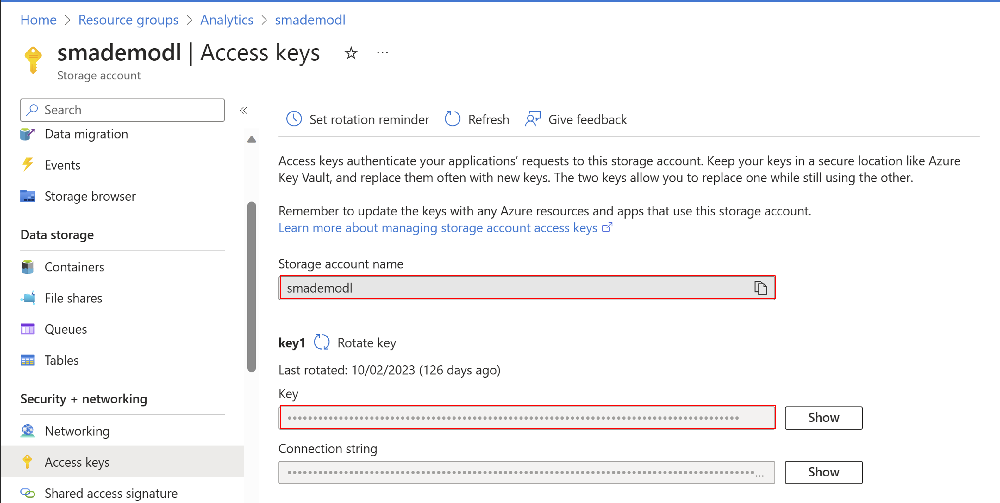
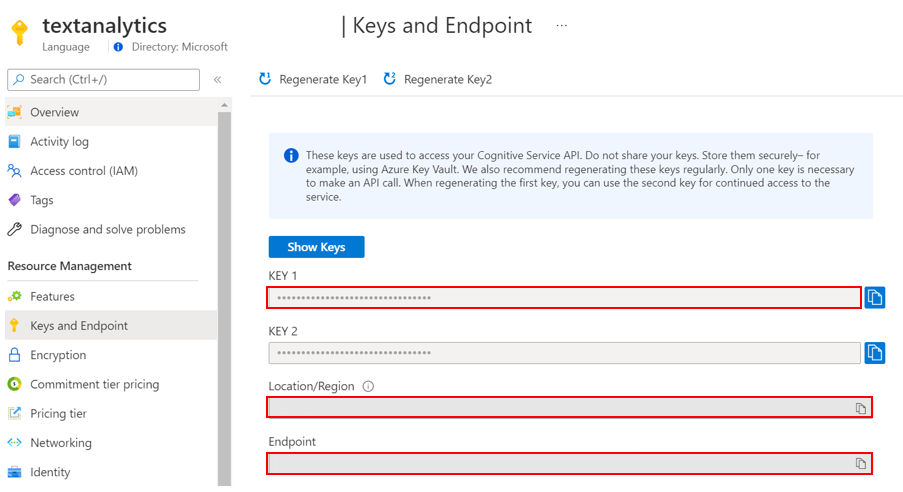
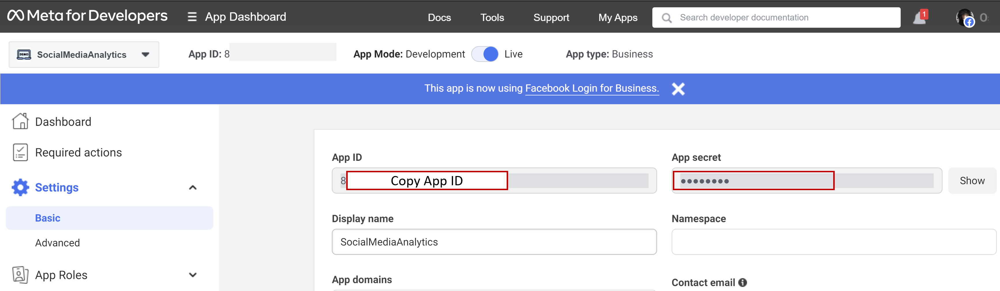
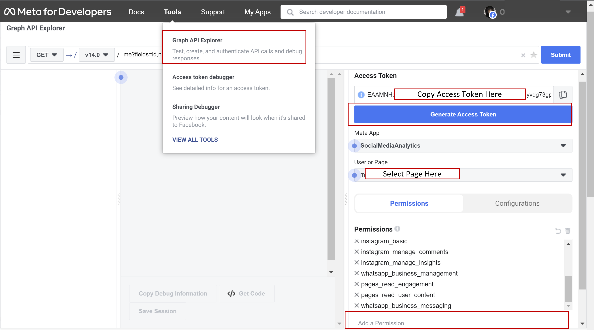
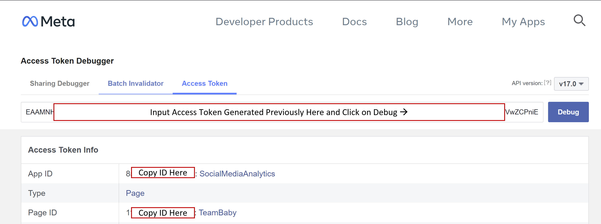
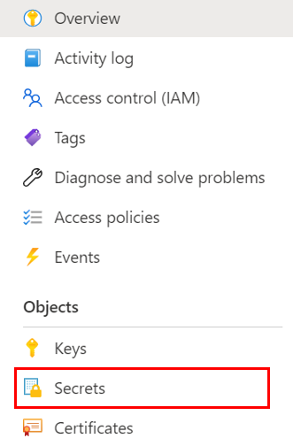
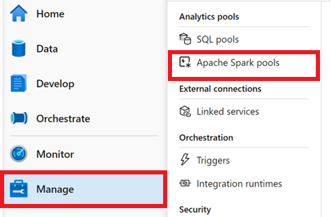
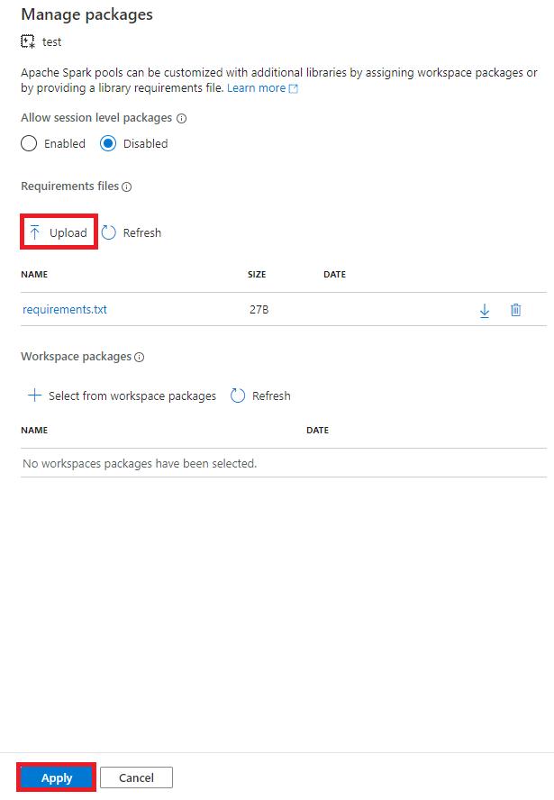

# Deployment Guide 
Please follow the steps below to set up the Azure environment

## Step 1: Download Files
Clone or download this repository and navigate to the project's root directory.

## Step 2: Deploy Key Vault Secrets 
The button below will deploy secrets into the Azure Key Vault you are using for this solution:

> Note: This deployment assumes you have created a [Facebook developer account](https://developers.facebook.com/tools/)

### **Configuring the ARM template**
In order to deploy the secrets into the Azure Key Vault, we need to configure the following variables.

 

Populate the variables accordingly: 

1. **Resource group**: Use the `same resource group` where the previous ARM template was deployed.
2. **Region**: This field will be auto-filled
3. **Key Vault Name**: The name of the Azure Key Vault that was created during previous steps
4. **Storage Account**: The name of your Storage account that was created in previous steps 
5. **Storage Account Key**: The key for your Storage account that was created in previous steps 

6. **Sentiment Key**: The key for your Text Analytics resource that was created in previous steps 
7. **Sentiment URL**: The endpoint for your Text Analytics resource that was created in previous steps 

 > The Facebook App ID, Secret, Page Token and Page ID (8-11) can be obtained in your [Facebook developer account](https://developers.facebook.com/tools/explorer/) 
8. **Facebook App ID**
9. **Facebook App Secret**

10. **Facebook Page Token**

11. **Facebook Page ID**

## Step 3: Security Access
### Step 3.1: Add Azure Synapse to Azure Key Vault 
1. Go to the Key Vault that was created in the previous step 
2. Click `Access policies`, click `+ Add Access Policy`, on the new window, on the `Secret Permissions` select `Get` and `List`. 
3. On the `Select principal` option, add your synapse resource name to be added to the Key vault and click `Save`
4. Select `Review + create` and `Save` the changes made. 

## Step 4: Set up Assets and load Data

### Step 4.1: Attach libraries to spark cluster
1. Launch the Synapse workspace [Synapse Workspace](https://ms.web.azuresynapse.net/)
2. Select the `subscription` and `workspace` name you are using for this solution accelerator
3. Navigate to the `Manage` tab in the Studio and click on the `Apache Spark pools`  

5. Click `...` on the deployed Spark Pool and select `Packages`
6. Click `Upload` and select [requirements.txt](https://github.com/microsoft/Azure-Social-Media-Analytics-Solution-Accelerator/main/Deployment/Code/requirements.txt) from the cloned repo.
7. Click `Apply`

### Step 4.2: Create Key Vault Linked Service 
1. Launch the Synapse workspace [Synapse Workspace](https://ms.web.azuresynapse.net/)
2. Select the `subscription` and `workspace` name you are using for this solution accelerator
3. Navigate to the `Manage` Hub, under "External connection" click `Linked services`
4. Click `+ New`, select `Azure Key Vault`, select the subscription you are using for this solution from the "Azure Subscription" dropdown, and select your Azure Key Vault name from the "Azure key vault name" dropdown
5. Change the name of the linked service to `KeyVaultLinkedService`
6. Click "Test connection" and click "Save"

### Step 4.3: Upload Noteboks
1. Launch the Synapse workspace [Synapse Workspace](https://ms.web.azuresynapse.net/)
2. Go to `Develop`, click the `+`, and click `Import` to select the notebooks in this repository's [folder](https://github.com/microsoft/Azure-Social-Media-Analytics-Solution-Accelerator/tree/main/Code/Notebooks)
3. For the notebooks, select `Attach to > spark1` in the top dropdown
<!-- 4. Configure the parameters in the notebook i.e. Key Vault Name and run each cell, ensure to get a permanent facebook token after which you can update the same in Azure Key Vault for subsequent use. Publish the changes upon completion. Data should now be available in the storage account, under `Tables`.
    * `Ingest_Process_Facebook.ipynb`
 -->

### Step 4.4: Set up Pipelines to Automate Run
1. In Synapse workspace, go to `Integrate`, click the "+", and choose `Pipeline`
2. The new `Pipeline 1` appears, click on the three dots `...` on the right corner , click `Rename`, change the pipeline name to `Process_Facebook_Pipeline`
3. From the Activities sectiion, Expand `Synapse` then drag and drop `Notebook` from the left to the right canvas. While Notebook is selected in the canvas, edit the name in the General section below to Process_Facebook_Data. Navigate to settings, select the Notebook `Ingest_Process_Facebook` and attach the sparkpool.
6. Click `Publish all` at the top of the page.
7. Click `Add trigger`, select `Trigger now` to run the pipeline.
Alternatively, add a scheduled trigger to run the pipeline on a daily basis

## Step 5: Power BI Set Up 
1. Open Power BI Desktop

2. Go to Get Data > More > Azure > Azure Table Storage and enter the `Storage account name` created earlier. Load all tables. Go to "Transform Data" to expand the content column for each table to view data for further analysis and visualisation.