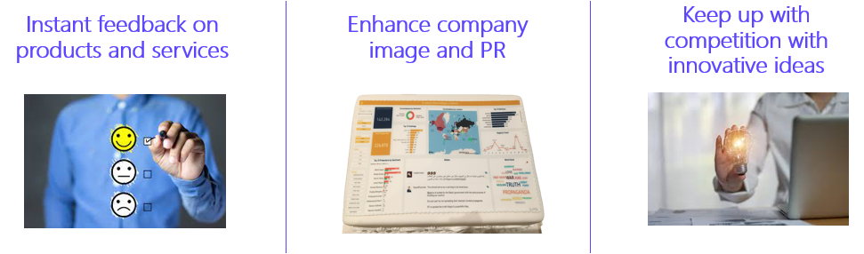
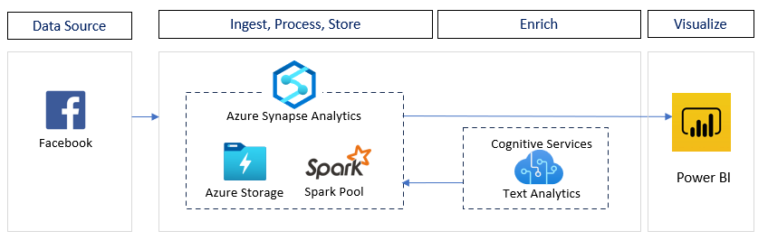
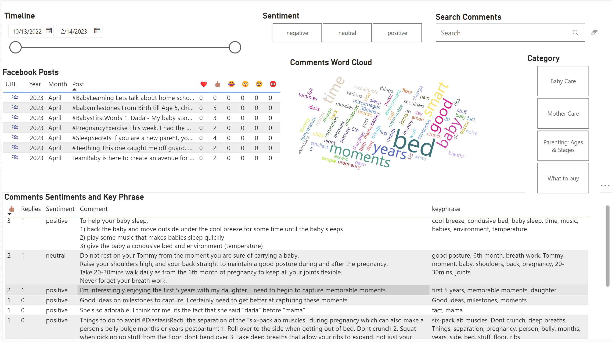

# Social-Media-Analytics-Facebook

Monitoring social media has become important for companies and organizations around the world. It is an essential tool for innovation and marketing. Its benefits range from the ability to get instant feedback on products and services, allowing better relations with end users and customers, providing a means to increase user satisfaction very quickly, and keeping up with the competition.

This solution accelerator helps developers with all the resources needed to build a Social Media monitoring platform that helps collect data from social media sites and websites and evaluate that data to make business decisions

 

## Prerequisites
To use this solution accelerator, you will need access to an [Azure subscription](https://azure.microsoft.com/en-us/free/). While not required, a prior understanding of Azure Synapse Analytics, Azure Cognitive Services, and Power BI  will be helpful.

For additional training and support, please see:

1. [Azure Synapse Analytics](https://azure.microsoft.com/en-us/services/synapse-analytics/)
2. [Azure Text Analytics](https://azure.microsoft.com/en-us/services/cognitive-services/text-analytics)
3. [Power BI](https://docs.microsoft.com/en-us/power-bi/fundamentals/power-bi-overview)

## Getting Started

### ***Note***
Azure Cogntive Services require to accept the terms and conditions of Responsible AI when they are first provisioned in an Azure subscription. If none of the Cognitive Services were provisioned previously in the Azure subscription, it is necessary to create a temporary cognitive service (for example Language Service) to accept the AI license terms. The service can be dropped after the creation. Once the requirements are in place, the deploy to Azure button can be used to deploy and configure the solution.

The button below will deploy Azure Synapse Analytics, Azure Language Service, Azure Translator, Azure Maps and its related resources:

* Go to the [Deployment guide](./Deployment/Deployment.md) to set up your Azure resources for this solution.  

## Architecture

The architecture diagram below details what you will be building for this Solution Accelerator.

## Power BI Dashboards

**Summary Dashboard** - View notable topics, hashtags, influencers, accounts, and locations where there's heightened interest
>Note: Due to Facebook and Instagram limitations, business and creator profiles with fewer than 100 followers won’t see audience demographics, including age, gender, location, and language.

## License
MIT License

THE SOFTWARE IS PROVIDED "AS IS", WITHOUT WARRANTY OF ANY KIND, EXPRESS OR
IMPLIED, INCLUDING BUT NOT LIMITED TO THE WARRANTIES OF MERCHANTABILITY,
FITNESS FOR A PARTICULAR PURPOSE AND NONINFRINGEMENT. IN NO EVENT SHALL THE
AUTHORS OR COPYRIGHT HOLDERS BE LIABLE FOR ANY CLAIM, DAMAGES OR OTHER
LIABILITY, WHETHER IN AN ACTION OF CONTRACT, TORT OR OTHERWISE, ARISING FROM,
OUT OF OR IN CONNECTION WITH THE SOFTWARE OR THE USE OR OTHER DEALINGS IN THE
SOFTWARE

## Contributing
This project welcomes contributions and suggestions.  Most contributions require you to agree to a Contributor License Agreement (CLA) declaring that you have the right to, and actually do, grant us the rights to use your contribution. For details, visit https://cla.opensource.microsoft.com.

When you submit a pull request, a CLA bot will automatically determine whether you need to provide a CLA and decorate the PR appropriately (e.g., status check, comment). Simply follow the instructions provided by the bot. You will only need to do this once across all repos using our CLA.

## Trademarks
This project may contain trademarks or logos for projects, products, or services. Authorized use of Microsoft trademarks or logos is subject to and must follow [Microsoft's Trademark & Brand Guidelines](https://www.microsoft.com/en-us/legal/intellectualproperty/trademarks/usage/general). Use of Microsoft trademarks or logos in modified versions of this project must not cause confusion or imply Microsoft sponsorship. Any use of third-party trademarks or logos are subject to those third-party's policies.

